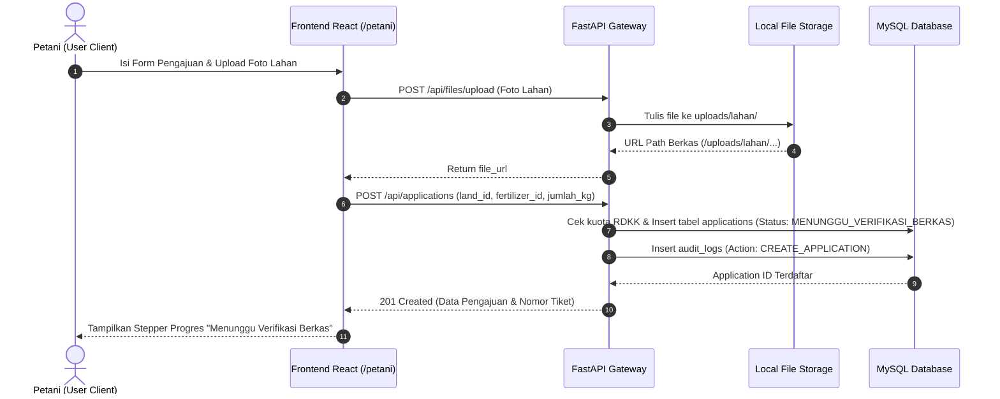
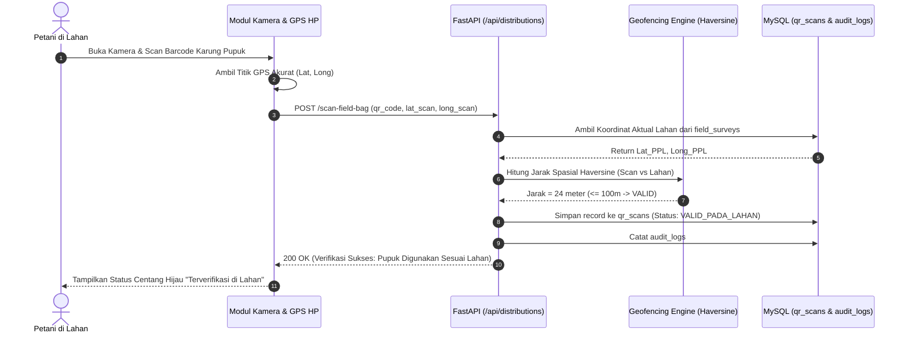
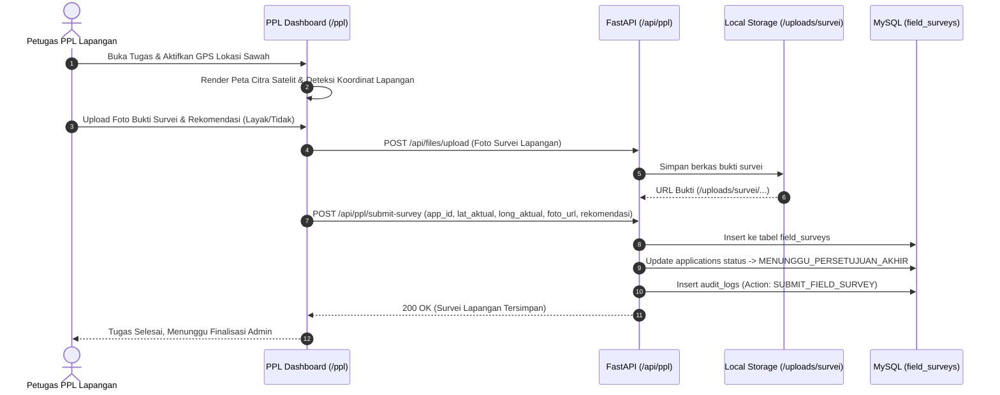

# Alur Detail Arsitektur E-Pupuk (Sistem Pengajuan Subsidi Pupuk Kabupaten Mojokerto)

Dokumen ini menjabarkan alur lengkap **Input → Proses → Output → Tujuan** untuk setiap fitur di arsitektur sistem **E-Pupuk Kabupaten Mojokerto**, mulai dari sisi antarmuka pengguna (*User Client*), layanan *backend*, *pipeline* verifikasi & *geofencing*, hingga integrasi basis data dan data terbuka pemerintah (*open data*).

---

## 0. Diagram Arsitektur Keseluruhan (E-Pupuk)

```mermaid
graph TD
    subgraph CLIENT [USER CLIENT - React 18 + Vite]
        subgraph PETANI [Petani - Mobile/Web]
            P_IN["View-Input:<br/>• Login / Registrasi NIK<br/>• Pendaftaran Lahan & GPS<br/>• Form Pengajuan Pupuk<br/>• Scan Barcode Buka Karung"]
            P_OUT["View-Output:<br/>• Stepper Status Pengajuan<br/>• Digital QR Voucher Tebus<br/>• Notifikasi Validasi Geofence"]
        end

        subgraph ADMIN_PEMDA [Admin Pemda / Dinas Pertanian]
            A_IN["View-Input:<br/>• Verifikasi Berkas (KTP/Lahan)<br/>• Penugasan PPL (Disposisi)<br/>• Approval Final & Penetapan Kuota"]
            A_OUT["View-Output:<br/>• Dashboard KPI Mojokerto<br/>• Monitoring Serapan Wilayah<br/>• Audit Log Penyaluran"]
        end

        subgraph PPL_FIELD [Petugas PPL / Surveyor Lapangan]
            PPL_IN["View-Input:<br/>• Review Tugas Wilayah<br/>• Input GPS Aktual Lahan<br/>• Peta Satelit & Poligon<br/>• Foto Bukti & Rekomendasi"]
            PPL_OUT["View-Output:<br/>• Daftar Tugas Lapangan<br/>• Status Verifikasi Fisik"]
        end

        subgraph KIOSK_GUDANG [Petugas Kios / Gudang Pupuk]
            K_IN["View-Input:<br/>• Scan QR Voucher Petani<br/>• Input Konfirmasi Penyaluran"]
            K_OUT["View-Output:<br/>• Validasi Kuota Fisik<br/>• Bukti Serah Terima Pupuk"]
        end
    end

    subgraph BACKEND [BACKEND SERVICES - Python FastAPI]
        API["FastAPI Core Engine<br/>- REST API Gateway<br/>- JWT Bearer & RBAC Guard<br/>- CORS Middleware"]
        RDKK_ENGINE["Modul Kalkulasi Kuota RDKK<br/>Baseline Luas Lahan vs Komoditas"]
        GEO_ENGINE["Modul Geofencing Spasial<br/>Haversine Formula: GPS Scan vs PPL (<=100m)"]
        QR_ENGINE["Modul QR Generator & Hash Token<br/>Enkripsi Token Digital Voucher"]
        DB[("MySQL Database<br/>users, farmers, lands, applications,<br/>field_surveys, distributions, qr_scans")]
        FS[("Local File Storage<br/>uploads/ktp/, uploads/lahan/, uploads/survei/")]
        AUDIT["Audit Trail Logger<br/>Mencatat Aksi Seluruh Aktor"]
    end

    subgraph EXTDATA [EXTERNAL DATA & OPEN DATA]
        EXT["Open Data Pertanian Mojokerto,<br/>e-RDKK Kementan,<br/>Peta Citra Satelit OpenStreetMap/Esri"]
    end

    %% Client ke Backend
    P_IN -->|HTTPS / REST + JWT| API
    A_IN -->|HTTPS / REST + JWT| API
    PPL_IN -->|HTTPS / REST + JWT| API
    K_IN -->|HTTPS / REST + JWT| API

    %% Backend ke Client Output
    API -->|Response JSON / Stepper| P_OUT
    API -->|Dashboard Data / KPI| A_OUT
    API -->|Task Data / Map Poligon| PPL_OUT
    API -->|Validasi Penebusan| K_OUT

    %% Backend Internal Processing
    API -->|Validasi Pengajuan| RDKK_ENGINE
    RDKK_ENGINE -->|Batas Kuota Maksimal| DB

    API -->|Koordinat Scan Karung| GEO_ENGINE
    GEO_ENGINE -->|Status Kepatuhan Spasial| DB

    API -->|Generate Token Tebus| QR_ENGINE
    QR_ENGINE -->|Hash Token QR| DB

    API <-->|CRUD Data Master & Transaksi| DB
    API -->|Simpan Berkas Upload| FS
    FS -->|Baca Berkas Gambar| API

    %% Logging & Audit Trail
    A_IN -.->|Verifikasi & Approval| AUDIT
    PPL_IN -.->|Hasil Survei Lapangan| AUDIT
    K_IN -.->|Transaksi Penebusan| AUDIT
    AUDIT --> DB

    %% External Data Inisialisasi
    EXT -.->|One-time Seed / Baseline Kuota & Peta| API
```



---

## 1. USER CLIENT — PETANI

### 1.1 Login & Registrasi NIK Petani
| Komponen | Penjelasan Rinci |
|---|---|
| **Input** | NIK (16 digit), Nama Lengkap, Nomor Kontak/WA, Kata Sandi, Pilihan Kelompok Tani (Poktan), Upload Foto KTP (`.jpg`/`.png`). |
| **Proses** | 1. `FastAPI /api/auth/register` memeriksa keunikan NIK dan username.<br/>2. Password di-hash menggunakan **Bcrypt**.<br/>3. Berkas KTP disimpan ke `Local File Storage` (`uploads/ktp/`), path disimpan pada tabel `farmers`.<br/>4. Data tersimpan di tabel `users` (role `PETANI`) dan `farmers`.<br/>5. Saat login (`/api/auth/login`), sistem memvalidasi password dan menerbitkan **JWT Access Token** dengan *claims* `role=PETANI` dan `farmer_id`. |
| **Output** | Token JWT tersimpan di *state client* (Zustand) $\rightarrow$ redirect ke `PetaniDashboard` (`/petani`). |
| **Tujuan** | Memastikan identitas petani valid dan terhubung dengan kelompok tani resmi di Kabupaten Mojokerto (RBAC). |

---

### 1.2 Pendaftaran Data Lahan Pertanian
| Komponen | Penjelasan Rinci |
|---|---|
| **Input** | Luas Lahan ($m^2$), Titik Koordinat GPS Lahan (`latitude`, `longitude` via *interactive map picker*), Status Kepemilikan (Milik Sendiri / Sewa / Garap), Komoditas Utama (Padi / Jagung / Tebu / Kedelai), Upload Foto Fisik Lahan. |
| **Proses** | 1. `FastAPI /api/lands` memvalidasi batasan koordinat berada dalam batas administratif Kabupaten Mojokerto.<br/>2. Foto lahan disimpan ke `uploads/lahan/`.<br/>3. Data lahan direkam ke tabel `lands` berelasi dengan `farmer_id`. |
| **Output** | ID Lahan Terdaftar dan profil spasial lahan muncul pada pilihan pengajuan petani. |
| **Tujuan** | Menjadi data acuan dasar (*baseline*) penentuan kelayakan kuota pupuk subsidi berdasarkan luas tanam. |

---

### 1.3 Form Pengajuan Alokasi Subsidi Pupuk
| Komponen | Penjelasan Rinci |
|---|---|
| **Input** | Pilihan Lahan Terdaftar, Pilihan Jenis Pupuk Bersubsidi (Urea, NPK Phonska, Organik), Jumlah Alokasi yang Diajukan ($kg$). |
| **Proses** | 1. `FastAPI /api/applications` menghitung batas kuota maksimum RDKK berdasarkan rasio luas lahan ($kg/m^2$) dan komoditas.<br/>2. Jika permohonan melebihi kuota maksimal, sistem memberikan peringatan.<br/>3. Data pengajuan disimpan ke tabel `applications` dengan status awal: **`MENUNGGU_VERIFIKASI_BERKAS`**.<br/>4. Event pengajuan baru dicatat di `audit_logs` dan memicu notifikasi ke Admin Pemda. |
| **Output** | Nomor Registrasi Pengajuan unik dan kartu status aktif di dashboard petani. |
| **Tujuan** | Merekam permintaan pupuk petani secara terstruktur dan mencegah pengajuan kuota yang tidak wajar sejak awal. |

#### Sequence Diagram Submit Pengajuan Petani:


---

### 1.4 Tracking Status Pengajuan
| Komponen | Penjelasan Rinci |
|---|---|
| **Input** | ID Pengajuan / Sesi Login Aktif Petani. |
| **Proses** | `FastAPI /api/applications` mengambil status terkini dari database yang bergerak melalui 7 status utama:<br/>`DIAJUKAN` $\rightarrow$ `BERKAS_TERVERIFIKASI` $\rightarrow$ `DITUGASKAN_KE_PPL` $\rightarrow$ `SURVEI_LAPANGAN` $\rightarrow$ `MENUNGGU_PERSETUJUAN_AKHIR` $\rightarrow$ `DIJADWALKAN_DISTRIBUSI` $\rightarrow$ `TERSALURKAN`. |
| **Output** | Komponen `ProgressStepper.jsx` menampilkan tahapan proses, catatan petugas, dan estimasi tanggal penyaluran. |
| **Tujuan** | Memberikan transparansi menyeluruh kepada petani sehingga petani tahu posisi berkasnya tanpa perlu datang ke kantor dinas. |

---

### 1.5 Pengambilan Pupuk di Kios (Digital QR Voucher)
| Komponen | Penjelasan Rinci |
|---|---|
| **Input** | Pengajuan berstatus `DIJADWALKAN_DISTRIBUSI`. |
| **Proses** | 1. Sistem membaca tabel `distributions` yang memuat `qr_hash` terenkripsi.<br/>2. Frontend merender komponen `Digital Voucher Card` berisi QR Code dinamis dan rincian alokasi (misal: 150 kg Urea). |
| **Output** | Tampilan QR Code resmi siap dipindai di kios/gudang pupuk resmi desa. |
| **Tujuan** | Sebagai alat tebus resmi digital pengganti kartu manual, mencegah pemalsuan identitas penerima. |

---

### 1.6 Pemindaian Buka Karung di Lahan (Geofencing Anti-Penyelundupan)
| Komponen | Penjelasan Rinci |
|---|---|
| **Input** | Scan barcode/QR pada karung pupuk saat dibuka di lokasi sawah + Koordinat GPS otomatis dari perangkat HP petani. |
| **Proses** | 1. `FastAPI /api/distributions/scan-field-bag` menerima payload `{distribution_id, barcode_karung, latitude_scan, longitude_scan}`.<br/>2. **Modul Geofencing** menghitung jarak (*Haversine Distance*) antara koordinat GPS scan HP dengan koordinat lahan hasil verifikasi survei PPL.<br/>3. Jika jarak $\le 100\text{ meter}$, status scan dinyatakan **`VALID_PADA_LAHAN`**.<br/>4. Jika jarak $> 100\text{ meter}$, sistem menandai **`POTENSI_PENYALAHGUNAAN`** dan memberi peringatan. |
| **Output** | Notifikasi keberhasilan verifikasi pemanfaatan pupuk dan sertifikat kepatuhan digital. |
| **Tujuan** | Memastikan pupuk bersubsidi benar-benar dibuka dan digunakan di lahan pertanian terdaftar, bukan dijual kembali ke pihak lain. |

#### Sequence Diagram Geofencing Buka Karung:


---

## 2. USER CLIENT — ADMIN PEMDA, PETUGAS PPL & KIOS

### 2.1 Login Multi-Role (RBAC)
| Komponen | Penjelasan Rinci |
|---|---|
| **Input** | Username dan Kata Sandi petugas. |
| **Proses** | `FastAPI /api/auth/login` memvalidasi kredensial dan memeriksa `role` (`ADMIN`, `PPL`, `PETANI`). Berdasarkan role, token JWT diterbitkan dan router frontend mengarahkan ke dashboard yang sesuai. |
| **Output** | Akses ke `AdminDashboard` (`/admin`), `PPLDashboard` (`/ppl`), atau `QRScannerKiosk` (`/kiosk-scanner`). |
| **Tujuan** | Menjaga integritas data dan membatasi wewenang operasional tiap tingkatan pengguna. |

---

### 2.2 Verifikasi Berkas Pengajuan Petani (Admin Pemda)
| Komponen | Penjelasan Rinci |
|---|---|
| **Input** | Berkas digital pengajuan status `MENUNGGU_VERIFIKASI_BERKAS` (Foto KTP, Foto Lahan, Luas m², Titik Peta Awal). Keputusan Admin: **Approve Berkas** / **Minta Perbaikan** / **Tolak Berkas**. |
| **Proses** | 1. Admin memeriksa kesesuaian NIK di KTP dan batas kuota awal.<br/>2. `FastAPI /api/admin/verify-doc` memperbarui status pengajuan menjadi `BERKAS_TERVERIFIKASI` atau `PERLU_PERBAIKAN_BERKAS`.<br/>3. Catatan revisi dikirim ke notifikasi petani. |
| **Output** | Pengajuan berstatus `BERKAS_TERVERIFIKASI` siap masuk ke antrean penugasan survei lapangan PPL. |
| **Tujuan** | Filter tahap pertama untuk mengeliminasi berkas fiktif atau data yang tidak lengkap sebelum tim lapangan ditugaskan. |

---

### 2.3 Disposisi & Penugasan PPL (Admin Pemda)
| Komponen | Penjelasan Rinci |
|---|---|
| **Input** | Pilihan Petugas PPL yang bertugas di wilayah kecamatan/desa terkait, Instruksi khusus survei. |
| **Proses** | 1. `FastAPI /api/admin/assign-ppl` memasukkan `assigned_ppl_id` pada pengajuan terpilih.<br/>2. Status pengajuan bertransisi ke **`DITUGASKAN_KE_PPL`**.<br/>3. Notifikasi penugasan baru diteruskan ke akun PPL bersangkutan. |
| **Output** | Tugas baru muncul pada tabel antrean survei di `PPLDashboard`. |
| **Tujuan** | Mendistribusikan beban verifikasi lapangan ke petugas penyuluh yang membawahi wilayah setempat. |

---

### 2.4 Survei Lapangan & Validasi Citra Satelit (Petugas PPL)
| Komponen | Penjelasan Rinci |
|---|---|
| **Input** | Titik GPS Aktual Lapangan, Penarikan Batas Lahan di Peta Satelit, Kondisi Tanaman (Fase Tanam/Jenis Komoditas), Kondisi Ekonomi Petani, Upload Foto Bukti Lapangan Bersama Petani, Rekomendasi Kelayakan (**SETUJU** / **TOLAK**). |
| **Proses** | 1. `PPLDashboard` memuat peta satelit interaktif (Esri Satellite / Leaflet).<br/>2. PPL menginput koordinat GPS *real-time* di lokasi sawah.<br/>3. Foto bukti survei di-upload ke `uploads/survei/`.<br/>4. `FastAPI /api/ppl/submit-survey` menyimpan seluruh data ke tabel `field_surveys`.<br/>5. Status pengajuan diubah menjadi **`MENUNGGU_PERSETUJUAN_AKHIR`**. |
| **Output** | Laporan digital survei lapangan lengkap dengan foto geocoding dan penilaian kelayakan. |
| **Tujuan** | Validasi faktual fisik bahwa lahan benar-benar ada, sedang aktif ditanami, dan layak menerima pupuk subsidi. |

#### Sequence Diagram Verifikasi Lapangan PPL:


---

### 2.5 Persetujuan Akhir & Penerbitan Kuota QR (Admin Pemda)
| Komponen | Penjelasan Rinci |
|---|---|
| **Input** | Review hasil survei PPL, Input jumlah kuota pupuk final yang disetujui ($kg$), Penetapan jadwal tanggal penebusan. |
| **Proses** | 1. `FastAPI /api/admin/final-approve` memvalidasi bahwa laporan PPL berstatus setuju.<br/>2. Sistem men-generate `qr_hash` unik (kombinasi `app_id`, `farmer_id`, timestamp, dan secret key).<br/>3. Data alokasi disimpan ke tabel `distributions`.<br/>4. Status pengajuan diubah menjadi **`DIJADWALKAN_DISTRIBUSI`**.<br/>5. Kuota subsidi agregat daerah terpotong otomatis. |
| **Output** | QR Code Digital Voucher aktif di aplikasi petani dan status pengajuan dijadwalkan distribusi. |
| **Tujuan** | Menjadi keputusan final penetapan alokasi pupuk bersubsidi berdasarkan verifikasi berjenjang. |

---

### 2.6 Validasi Penebusan Kios (Petugas Kios / Gudang)
| Komponen | Penjelasan Rinci |
|---|---|
| **Input** | Scan QR Code Voucher dari layar HP Petani menggunakan kamera Kiosk Scanner (`/kiosk-scanner`). |
| **Proses** | 1. `FastAPI /api/distributions/scan-kiosk` memvalidasi keaslian `qr_hash`.<br/>2. Sistem memastikan status distribusi masih `TERJADWAL` (belum pernah ditebus).<br/>3. Status diperbarui menjadi **`TERSALURKAN`** dan mencatat waktu realisasi.<br/>4. Transaksi dicatat ke `audit_logs`. |
| **Output** | Konfirmasi serah terima pupuk fisik dan kuota voucher dinyatakan hangus/terpakai. |
| **Tujuan** | Mencegah penebusan ganda (*double claim*) dan mencatat penyaluran secara *real-time*. |

---

### 2.7 Dashboard Monitoring Eksekutif (Pimpinan Dinas Pertanian)
| Komponen | Penjelasan Rinci |
|---|---|
| **Input** | Filter wilayah (Kecamatan di Mojokerto), Jenis Komoditas, Jenis Pupuk, Rentang Waktu. |
| **Proses** | `FastAPI /api/admin/stats` melakukan agregasi database SQL:<br/>• Total Pengajuan, Kuota Terserap vs Sisa Kuota Daerah.<br/>• Persentase persetujuan berkas vs survei PPL.<br/>• Peta sebaran spasial distribusi pupuk per kecamatan. |
| **Output** | Grafik serapan pupuk, kartu KPI metrik, dan tabel rekapitulasi audit siap cetak. |
| **Tujuan** | *Executive dashboard* untuk pemantauan akuntabilitas publik dan evaluasi kebijakan distribusi pupuk daerah. |

---

## 3. BACKEND — Pipa Data & Engine Pemrosesan

Alur logika pemrosesan internal backend E-Pupuk dibagi menjadi 4 jalur pipa utama:

```
1. PIPA PENGAJUAN & RDKK
   Input Data Petani (Luas Lahan & Komoditas)
      └─> Hitung Rasio Kuota Baseline RDKK
      └─> Simpan Pengajuan (Status: MENUNGGU_VERIFIKASI_BERKAS)

2. PIPA VALIDASI BERJENJANG (HUMAN-IN-THE-LOOP)
   Admin Verifikasi Berkas (KTP/Lahan) ──> Lolos: BERKAS_TERVERIFIKASI
      └─> Penugasan PPL Wilayah ──> DITUGASKAN_KE_PPL
      └─> PPL Survei Lapangan + Citra Satelit ──> Simpan field_surveys
      └─> Admin Final Approve ──> Generate QR Hash ──> DIJADWALKAN_DISTRIBUSI

3. PIPA PENEBUSAN GUDANG
   Scan QR Voucher di Kios ──> Validasi Hash Token ──> TERSALURKAN

4. PIPA GEOFENCING BUKA KARUNG (ANTI-FRAUD)
   Petani Scan Barcode Karung di Lahan
      └─> Ambil GPS Scan HP
      └─> Hitung Haversine Distance (GPS Scan vs GPS PPL Lapangan)
      └─> Hasil: Jarak <= 100m (VALID_PADA_LAHAN) atau > 100m (ANOMALI)
      └─> Rekam ke qr_scans & audit_logs
```

---

## 4. BACKEND — Komponen & Jalur Tambahan

### 4.1 Local File Storage
* Komponen penyimpanan berkas statis di server local (`/uploads`).
* Terbagi dalam 3 direktori terisolasi:
  * `uploads/ktp/`: Berkas identitas KTP petani (hanya dapat diakses role ADMIN dan pemilik akun).
  * `uploads/lahan/`: Berkas foto fisik lahan awal pengajuan.
  * `uploads/survei/`: Berkas foto bukti survei faktual lapangan oleh PPL.
* Endpoint `GET /uploads/{subfolder}/{filename}` dilindungi validasi sanitasi nama file untuk mencegah *path traversal vulnerability*.

### 4.2 State Machine Lifecycle Pengajuan
* Setiap pengajuan diatur oleh *strict state machine* pada `routers/applications.py`.
* Transisi status hanya sah jika mengikuti urutan logis:
  $$\text{DIAJUKAN} \rightarrow \text{BERKAS\_TERVERIFIKASI} \rightarrow \text{DITUGASKAN\_KE\_PPL} \rightarrow \text{SURVEI\_LAPANGAN} \rightarrow \text{DISETUJUI} \rightarrow \text{TERSALURKAN}$$
* Setiap transisi status secara otomatis mencatat *timestamp* dan *actor ID* pada tabel `audit_logs`.

### 4.3 Centralized Audit Trail Logger
* Komponen pencatatan histori operasional yang dipicu pada setiap aksi kritis:
  1. Login & Logout Pengguna.
  2. Keputusan Verifikasi Berkas oleh Admin.
  3. Disposisi Penugasan PPL.
  4. Pengiriman Laporan Survei Lapangan oleh PPL.
  5. Persetujuan Akhir & Penerbitan Kuota oleh Admin.
  6. Transaksi Penebusan Pupuk di Kios.
  7. Pemindaian Barcode Karung Pupuk di Lahan.

### 4.4 Geofencing Spatial Engine (Haversine Formula)
* Modul matematika backend yang menghitung jarak busur lingkaran besar antara dua koordinat geografis:
  $$d = 2r \arcsin \left( \sqrt{\sin^2\left(\frac{\Delta \phi}{2}\right) + \cos(\phi_1)\cos(\phi_2)\sin^2\left(\frac{\Delta \lambda}{2}\right)} \right)$$
* Parameter radius bumi $r = 6371\text{ km}$. Toleransi jarak validasi pemanfaatan pupuk pada lahan ditetapkan maksimal $100\text{ meter}$.

---

## 5. EXTERNAL DATA & OPEN DATA — Sifat Integrasi

* **Sumber Data**:
  1. **Open Data Pertanian Kabupaten Mojokerto**: Data batas administratif kecamatan/desa, data komoditas pertanian unggulan, serta data kelompok tani (Poktan) binaan.
  2. **e-RDKK Kementerian Pertanian**: Referensi rasio baku alokasi pupuk bersubsidi per hektar.
  3. **Peta Spasial & Citra Satelit OpenStreetMap / Esri**: Penyedia *tile map* citra satelit untuk verifikasi poligon lahan PPL.
* **Sifat Integrasi**:
  * **Master Data Seeding (Fase Inisialisasi)**: Data terbuka komoditas dan batas kelompok tani di-seed ke database untuk mempermudah petani saat registrasi awal (*cold start*).
  * **Dynamic Spatial Layer**: *Tile server* satelit diakses langsung oleh *client-side* Leaflet/MapPicker secara *on-demand*.

---

## 6. Matriks Perbandingan Komponen & Tanggung Jawab Aktor

| No | Fitur / Tahapan | Aktor Utama | Masukan (*Input*) | Modul Pemrosesan | Keluaran (*Output*) |
|---|---|---|---|---|---|
| **1** | **Registrasi Petani** | Petani | NIK, Data Diri, Foto KTP | `auth.py`, `files.py` | Akun Petani & Profil Poktan |
| **2** | **Daftar Lahan** | Petani | Luas $m^2$, Titik GPS, Foto Lahan | `lands.py`, `files.py` | Entitas Lahan Terdaftar |
| **3** | **Pengajuan Subsidi** | Petani | ID Lahan, Pupuk, Jumlah kg | `applications.py` | Nomor Tiket (`MENUNGGU_VERIFIKASI_BERKAS`) |
| **4** | **Verifikasi Berkas** | Admin Pemda | Cek KTP & Lahan di Modal | `admin.py` | Status `BERKAS_TERVERIFIKASI` |
| **5** | **Penugasan PPL** | Admin Pemda | Pilih Petugas PPL Wilayah | `admin.py` | Status `DITUGASKAN_KE_PPL` & Task List PPL |
| **6** | **Survei Lapangan** | Petugas PPL | GPS Lapangan, Satelit, Foto Bukti | `ppl.py`, `files.py` | Status `MENUNGGU_PERSETUJUAN_AKHIR` |
| **7** | **Approval & Kuota** | Admin Pemda | Kuota Final (kg), Tanggal Tebus | `admin.py` | Status `DIJADWALKAN_DISTRIBUSI` & QR Voucher |
| **8** | **Penebusan Kios** | Petugas Kios | Scan QR Voucher Petani | `distributions.py` | Status `TERSALURKAN` |
| **9** | **Scan Buka Karung** | Petani di Sawah | Scan Barcode + GPS HP | `distributions.py` (Geofencing) | Status `VALID_PADA_LAHAN` di `qr_scans` |
| **10** | **Monitoring Eksekutif**| Pimpinan Dinas | Filter Kecamatan / Periode | `admin.py:get_stats` | Visualisasi KPI & Serapan Kuota |
