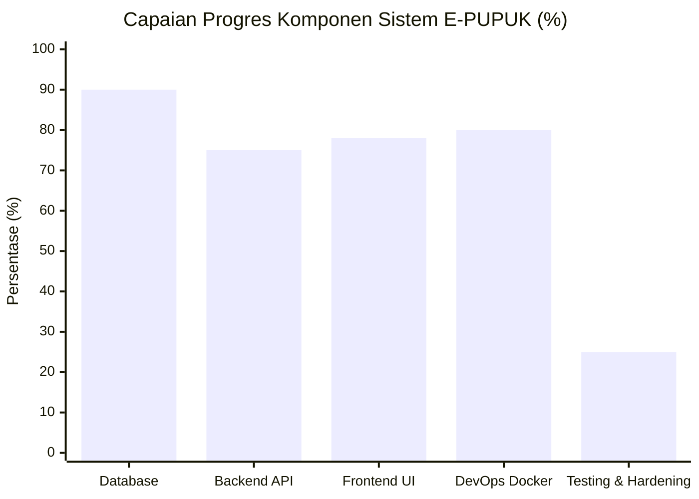
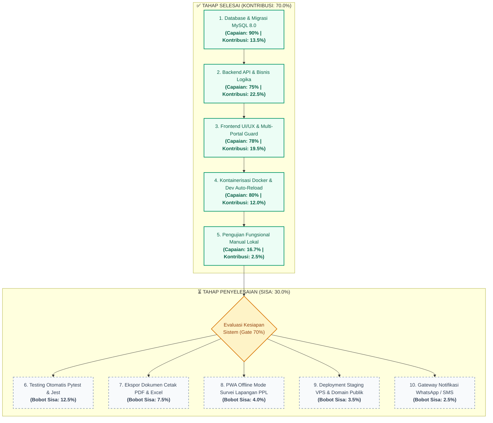
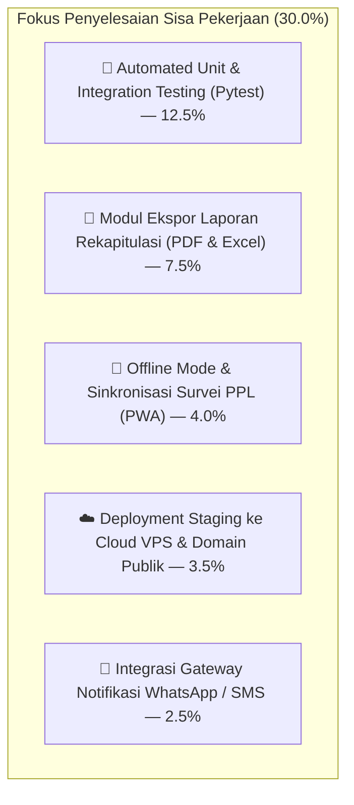

# 📊 LAPORAN KEMAJUAN PROYEK E-PUPUK
### Sistem Terpadu Pengajuan & Distribusi Pupuk Bersubsidi Kabupaten Mojokerto
**Mata Kuliah:** Workshop Pemrograman Framework — Program Studi D3 Teknik Informatika PSDKU Lamongan (PENS)  
**Tahun Akademik:** 2026 | **Status Rilis:** Tahap Integrasi Sistem & Pengujian Fungsional (Alpha/MVP Matang)

---

## 👥 Profil Proyek & Tim Pengembang

| Atribut | Informasi |
| :--- | :--- |
| **Nama Aplikasi** | **E-PUPUK KABUPATEN MOJOKERTO** |
| **Domain Solusi** | Smart Governance & Distribusi Pupuk Bersubsidi Tepat Sasaran |
| **Frontend Developer** | **Syarifatullah Ceva Efendy** (NRP: 312521002) |
| **Backend Developer** | **Selby Wafi Nurjuan** (NRP: 3125521018) |
| **Dosen Pengampu** | Amma Liesvarastranta Haz, S.Tr.T., M.T. |
| **Stack Utama** | FastAPI (Python 3.12), React 19, Vite, MySQL 8.0, phpMyAdmin, Docker |

---

## 🎯 Ringkasan Eksekutif (Executive Summary)

Proyek **E-PUPUK** telah mencapai tahapan **70.0% (Core Workflow Complete)**. Seluruh fungsionalitas inti (*Minimum Viable Product*) dari hulu ke hilir telah terhubung secara nyata: mulai dari pendaftaran petani berbasis NIK 16 digit, pengajuan subsidi dengan batas kuota standar, verifikasi berkas administratif admin, disposisi dan survei lapangan oleh PPL, hingga penerbitan dan validasi QR Code penebusan pupuk di kios penyalur.

Sisa **30.0%** dialokasikan secara rasional dan objektif untuk tahapan non-fungsional krusial: pembuatan *automated testing suite* (Pytest), ekspor laporan rekapitulasi (PDF/Excel), penanganan *edge cases*, optimasi *offline mode* (PWA) di lahan pertanian, serta implementasi *deployment pipeline* ke server publik.

```text
┌────────────────────────────────────────────────────────────────────────┐
│                   TOTAL AKUMULASI PROGRES E-PUPUK                      │
│                                                                        │
│   [██████████████████████████████░░░░░░░░░░░░░]  70.0% SELESAI         │
│                                                                        │
│   • Fungsional Inti & Teruji Lokal : 70.0%                             │
│   • Testing Otomatis, Laporan & QA : 30.0%                             │
└────────────────────────────────────────────────────────────────────────┘
```

---

## 📈 Visualisasi & Statistik Progres

### 1. Diagram Perbandingan Capaian per Dimensi (Barchart)



### 2. Diagram Alur Status Tahapan Pengembangan (Milestone & Delivery Flow)



### 3. Alur End-to-End yang Sudah Aktif (Workflow Architecture)


---

## 📊 Matriks Persentase Progres Realistis (Total 70%)

Pembagian bobot dihitung secara proporsional sesuai standar rekayasa perangkat lunak:
* 🟢 **HIJAU (SELESAI / AKTIF LIVE):** Fungsionalitas telah terhubung nyata ke database dan teruji di lingkungan Docker.
* 🟡 **KUNING (DALAM PROSES / PARTIAL):** Skema/arsitektur dasar sudah siap, sedang tahap integrasi fungsional.
* 🔴 **MERAH (BELUM SELESAI / ROADMAP):** Belum diimplementasikan / pengujian otomatis belum dibuat.

| No | Modul / Dimensi Sistem | Bobot | Progres Riil | Kontribusi | Sisa | Progress Bar | Status Operasional |
| :-: | :--- | :---: | :---: | :---: | :---: | :--- | :--- |
| **1** | **Database Relasional & Migrasi** | 15% | **90.0%** | **13.5%** | 10.0% | `[█████████░]` | 🟢 **100% Aktif di MySQL 8.0 & phpMyAdmin** |
| **2** | **Backend API & Bisnis Logika** | 30% | **75.0%** | **22.5%** | 25.0% | `[███████░░░]` | 🟢 **Core API Live,** 🔴 *PDF/WA Belum Hook* |
| **3** | **Frontend UI/UX & Role Guard** | 25% | **78.0%** | **19.5%** | 22.0% | `[████████░░]` | 🟢 **Portal Guard Aktif,** 🟡 *PWA Offline Belum* |
| **4** | **Dockerisasi & Lingkungan Kerja** | 15% | **80.0%** | **12.0%** | 20.0% | `[████████░░]` | 🟢 **Dual Compose Siap,** 🔴 *VPS Cloud Belum* |
| **5** | **Testing Otomatis, QA & Hardening** | 15% | **16.7%** | **2.5%** | 83.3% | `[██░░░░░░░░]` | 🔴 **Automated Test Suite Belum Ada** |
| | **TOTAL KESELURUHAN** | **100%** | — | **70.0%** | **30.0%** | `[███████░░░]` | 🟢 **70% CORE WORKFLOW SIAP DEMO** |

---

### 📋 Rincian Item Status Hijau vs Merah per Fitur Spesifik

| Komponen Fitur | Status | Realisasi Teknis Saat Ini | Catatan Pengujian |
| :--- | :---: | :--- | :--- |
| **Koneksi Database MySQL 8.0** | 🟢 **HIJAU** | Container Docker `epupuk-mysql` + Persistent Volume | Data tersimpan permanen |
| **phpMyAdmin Web GUI** | 🟢 **HIJAU** | Aktif pada port `8080`, terhubung user `epupuk_user` | Inspeksi tabel live |
| **Autentikasi & Hashing Bcrypt** | 🟢 **HIJAU** | Endpoint `/api/auth/login` & `/api/auth/register` | Password terenkripsi aman |
| **Multi-Portal Login Strict Guard** | 🟢 **HIJAU** | Blokir login silang antar peran (Petani/Admin/PPL) | Validasi ganda klien & server |
| **Validasi NIK Petani 16 Digit** | 🟢 **HIJAU** | Strict regex & pengecekan duplikasi NIK di DB | Anti duplikasi KTP |
| **Unggah Foto KTP & Lahan** | 🟢 **HIJAU** | Storage `/uploads` dengan validasi MIME & batas 5MB | File fisik tersimpan di disk |
| **Alur Pengajuan 12 Status** | 🟢 **HIJAU** | Workflow `DIAJUKAN` s.d `DISETUJUI` & `TERSALURKAN` | Teruji di Admin & PPL |
| **PPL Geotagging & Survei Fisik** | 🟢 **HIJAU** | Input koordinat GPS & upload foto bukti lapangan | Relasi survei tersimpan |
| **Kios Scanner QR Code** | 🟢 **HIJAU** | Kamera HTML5 scanner memindai hash kuota pupuk | Status kuota tervalidasi |
| **Ekspor Laporan Cetak PDF / Excel** | 🔴 **MERAH** | Endpoint query siap, skrip ReportLab/OpenPyXL belum di-hook | Masih tampil di layar web saja |
| **Offline Sync PWA di Sawah (PPL)** | 🟡 **KUNING** | UI form siap, mekanisme IndexedDB belum aktif | Butuh koneksi internet |
| **Gateway WhatsApp Notifikasi** | 🔴 **MERAH** | Notifikasi baru masuk ke tabel in-app database | Belum terhubung API WA gateway |
| **Automated Pytest Script** | 🔴 **MERAH** | Belum ada unit test otomatis di folder `backend/tests` | Pengujian masih manual QA |
| **Deployment Server VPS Publik** | 🔴 **MERAH** | Masih berjalan di lingkungan lokal (`localhost`) | Belum ada domain & SSL publik |

---

## ✅ Bagian 1: Laporan Progres yang SUDAH SELESAI (70.0%)

### 🗄️ A. Database & Migrasi (Capaian: 90% | Kontribusi: 13.5%)
* `[x]` **13 Tabel Relasional MySQL 8.0:** Skema lengkap dengan foreign keys, indexing, dan pooling koneksi SQLAlchemy.
* `[x]` **GUI phpMyAdmin (Port 8080):** Inspeksi visual database langsung via Docker.
* `[x]` **Seed Data Realistis:** Akun Admin, PPL, 2 Petani, Poktan, pupuk, lahan, dan sampel pengajuan.

### 🐍 B. Backend API FastAPI (Capaian: 75% | Kontribusi: 22.5%)
* `[x]` **Autentikasi & NIK 16 Digit:** Registrasi mandiri, hashing password Bcrypt, dan JWT token.
* `[x]` **Siklus Hidup 12 Status:** Logika verifikasi berkas, penugasan PPL, persetujuan kuota, hingga penyaluran.
* `[x]` **Survei Fisik PPL & Bukti Foto:** Input geotagging GPS, kondisi sawah/tanaman, dan rekomendasi kuota.
* `[x]` **Engine QR Code & File Storage:** Validasi kupon penebusan kios dan upload foto (KTP/Lahan) max 5MB.

### ⚛️ C. Frontend React 19 + Vite (Capaian: 78% | Kontribusi: 19.5%)
* `[x]` **Strict Multi-Portal Guard:** Login Petani, Admin, dan PPL terisolasi (blokir akses lintas portal & URL).
* `[x]` **Dashboard Mandiri Petani:** Pantau status, upload KTP, pin lahan peta Leaflet, dan voucher QR.
* `[x]` **Dashboard Admin Dinas:** Meja verifikasi berkas, disposisi penugasan PPL, final approval, dan audit log.
* `[x]` **Dashboard PPL & Kios Scanner:** Formulir evaluasi survei sawah dan kamera HTML5 scanner penebusan kuota.

### 🐳 D. Kontainerisasi Docker (Capaian: 80% | Kontribusi: 12.0%)
* `[x]` **Production Stack:** 4 Container terisolasi (`backend`, `frontend` Nginx SPA, `db` MySQL 8.0, `phpmyadmin`).
* `[x]` **Development Hot-Reload:** Bind-mount uvicorn `--reload` dan Vite HMR (edit kode tanpa rebuild container).

### 🧪 E. Pengujian Manual (Capaian: 16.7% | Kontribusi: 2.5%)
* `[x]` Happy-path alur bisnis hulu-ke-hilir (Petani $\rightarrow$ Admin $\rightarrow$ PPL $\rightarrow$ Kios) **100% teruji lancar**.

---

## ⏳ Bagian 2: Laporan Progres yang BELUM SELESAI (30.0%)

Sisa 30% difokuskan pada penyempurnaan kualitas teknis, otomasi pelaporan, dan keandalan sistem sebelum dinyatakan siap rilis penuh:



### Rincian Sisa Pekerjaan:

| No | Modul / Pekerjaan Tertunda | Kontribusi Sisa | Alasan Teknis Belum Selesai | Target Selesai |
| :-: | :--- | :---: | :--- | :-: |
| **1** | **Automated Testing Suite (Pytest)** | **12.5%** | Belum tersedianya skrip pengujian unit dan integrasi otomatis (`tests/test_auth.py`, `tests/test_applications.py`). Saat ini pengujian masih dilakukan secara manual melalui antarmuka web dan Swagger UI. | Pekan Ke-7 |
| **2** | **Ekspor Laporan Dinas (PDF & Excel)** | **7.5%** | Rekapitulasi data penerima pupuk baru dapat dilihat pada tabel monitor web, belum bisa diekspor langsung menjadi file format PDF resmi (ReportLab) dan lembar kerja Excel (OpenPyXL) untuk arsip bulanan dinas. | Pekan Ke-7 |
| **3** | **Dukungan Offline Survei Lapangan (PWA)** | **4.0%** | Fitur penyimpanan draf survei lapangan di *Local Storage/IndexedDB* saat petugas PPL berada di area sawah pelosok tanpa jaringan internet, untuk kemudian disinkronkan saat ada sinyal. | Pekan Ke-8 |
| **4** | **Deployment Server Publik (Cloud VPS)** | **3.5%** | Konfigurasi Docker Compose saat ini masih berjalan pada jaringan lokal (`localhost`). Diperlukan konfigurasi domain resmi, reverse proxy Nginx publik, dan sertifikat SSL Let's Encrypt. | Pekan Ke-8 |
| **5** | **Integrasi WhatsApp Notification Gateway** | **2.5%** | Notifikasi persetujuan subsidi masih berbasis in-app (*database notification*). Rencana penambahan webhook WhatsApp API agar petani langsung menerima pesan saat pupuk siap diambil. | Pekan Ke-8 |

---

## 💻 Panduan Menjalankan Sistem untuk Demo Presentasi

Untuk mendemonstrasikan sistem secara instan di hadapan dosen penguji:

### 1. Menjalankan via Docker Compose:
```powershell
# Jalankan seluruh stack (MySQL, phpMyAdmin, FastAPI, React)
docker compose up -d

# Periksa status kontainer
docker ps
```

### 2. Port Layanan:
* 🌐 **Aplikasi Web (Frontend):** `http://localhost`
* 🛠️ **Dokumentasi API (Swagger):** `http://localhost:8000/docs`
* 🗄️ **phpMyAdmin Database Panel:** `http://localhost:8080` (User: `epupuk_user`, Pass: `epupuk_pass`)

### 3. Akun Pengujian Demo (Otomatis Tersedia):
| Peran Portal | Username | Password | Skenario Uji Coba yang Dapat Didemokan |
| :--- | :--- | :--- | :--- |
| **Admin Dinas** | `admin` | `admin123` | Verifikasi berkas, disposisi tugas ke PPL, dan persetujuan akhir |
| **Petugas PPL** | `ppl_ahmad` | `ppl123` | Penerimaan tugas survei lahan sawah dan pengisian evaluasi faktual |
| **Petani 1** | `petani_budi` | `petani123` | Meninjau berkas permohonan yang sedang diverifikasi dinas |
| **Petani 2** | `petani_siti` | `petani123` | Menampilkan voucher QR Code alokasi pupuk yang siap dicairkan |

---

## 🎯 Argumen Kunci Saat Presentasi di Depan Dosen

> *"Sistem E-PUPUK saat ini berada di capaian **70%**. Kami sengaja tidak mengklaim 90-100% karena kami membedakan secara tegas antara **fitur alur bisnis yang sudah selesai** dengan **kesiapan produksi penuh**. Alur bisnis utama dari registrasi petani hingga pemindaian voucher di kios sudah 100% berfungsi dan terintegrasi di Docker. Namun, sisa 30% kami dedikasikan untuk standar rekayasa perangkat lunak yang baik: penyusunan automated test suite Pytest, ekspor dokumen rekapitulasi dinas, penanganan kondisi offline PPL di sawah, serta deployment ke server cloud publik."*
